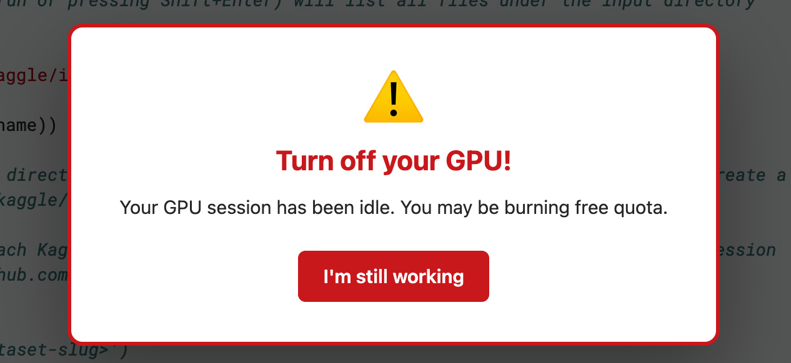
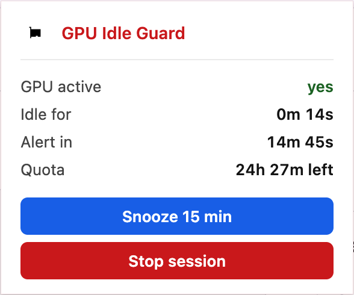

# GPU Idle Guard

A Chrome extension that prevents data scientists from accidentally burning their free GPU quotas on **Google Colab** and **Kaggle** by alerting them when a GPU session is active but no one is using it.


<p align="center">
  <br>
  <em>Walk away from a GPU session and it lets you know.</em>
</p>

<p align="center">
  <br>
  <em>Toolbar popup: live status, quota left, snooze, and stop-session.</em>
</p>

## Why

Free GPU on Colab and Kaggle is a finite resource. It is easy to spin up a runtime, walk away for a coffee, and come back to find half your weekly quota gone for nothing. GPU Idle Guard watches the page, detects whether a GPU session is actually running, tracks user interaction, and pops a hard-to-miss modal once you have been idle past the threshold.

## Features

- Works on `colab.research.google.com` and `kaggle.com/code`.
- Detects active GPU/TPU sessions from the page DOM.
- Tracks idle time (`keydown`, `mousemove`, `scroll`, `click`, `touchstart`).
- Fires a persistent modal after **15 min** of idleness (configurable).
- Plays an optional alert sound.
- Toolbar popup shows: GPU active y/n, idle duration, time until alert, remaining Kaggle quota.
- **Snooze 15 min** button.
- **Stop session** button — clicks Kaggle's native "Stop Session" / Colab's "Disconnect runtime".
- Per-tab tracking via `chrome.alarms`. Service-worker safe.

## Install (unpacked)

1. Clone:
   ```bash
   git clone https://github.com/<you>/gpu-idle-guard.git
   ```
2. Open `chrome://extensions` and enable **Developer mode**.
3. Click **Load unpacked** and select the cloned folder.
4. Open a Colab or Kaggle notebook, connect a GPU runtime, and you are guarded.

## Configuration

Edit `background.js`:

```js
const IDLE_MINUTES = 15;   // change to taste
```

Reload the extension afterwards.

## File layout

| File           | Purpose                                                                 |
|----------------|-------------------------------------------------------------------------|
| `manifest.json`| Manifest V3, permissions, content-script + popup wiring.                |
| `background.js`| Service worker. Owns the per-tab `chrome.alarms`, schedules the alert.  |
| `content.js`   | Runs in the page. DOM detection, idle tracking, modal injection.        |
| `styles.css`   | Modal styling (scoped to `#gpu-idle-guard-modal`).                      |
| `popup.html/js/css` | Toolbar popup UI.                                                  |
| `alert.mp3`    | Optional alert sound.                                                   |
| `icon*.png`    | Extension icons (16/48/128).                                            |

## DOM selectors are fragile

Google and Kaggle change their UI without warning. If detection stops working:

- **Kaggle**: edit `isKaggleGpuActive()` and `getKaggleQuota()` in `content.js`. Selectors use page text scraping because styled-components hashes are unstable.
- **Colab**: edit `isColabGpuActive()` in `content.js`. The `<colab-connect-button>` shadow DOM is the canonical hook.
- **Stop button**: edit `stopSession()` in `content.js`. Search the toolbar for the current "Stop" affordance.

## Permissions

| Permission | Why |
|------------|-----|
| `alarms`   | Schedule the idle-timeout alert.                |
| `scripting`| Inject the modal from the worker on alarm fire. |
| `storage`  | Persist per-tab state across worker suspensions.|
| `activeTab`| Read the active tab in the popup.               |
| host `colab.research.google.com`, `kaggle.com/code` | Content-script injection scope. |

No analytics. No network calls. No data leaves your browser.

## License

MIT — see `LICENSE`.

